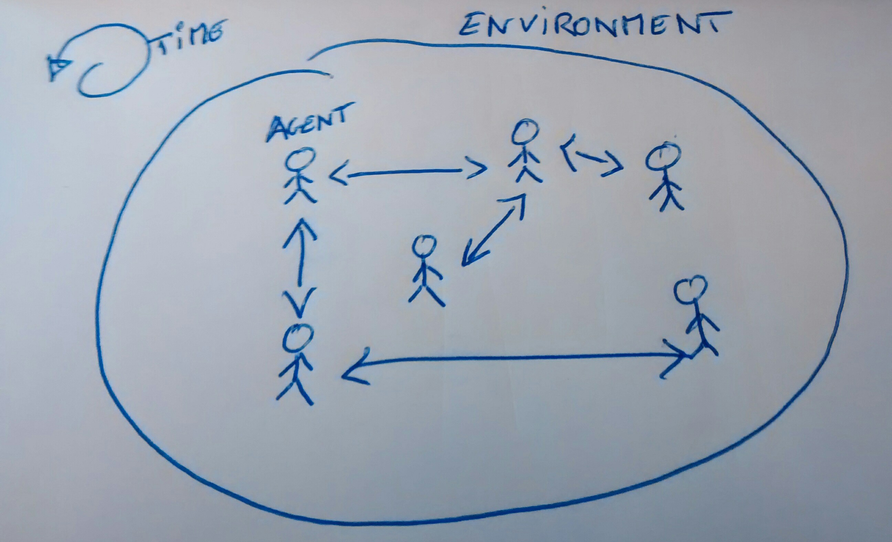
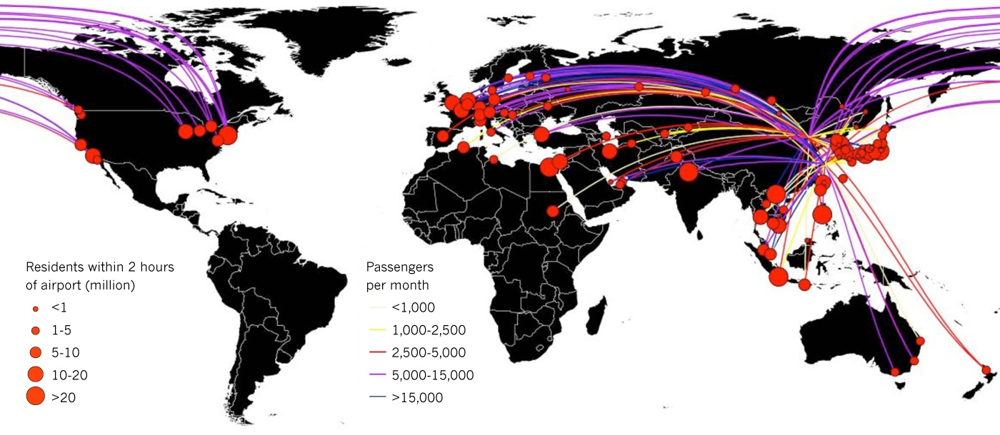
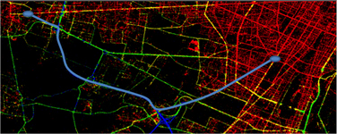
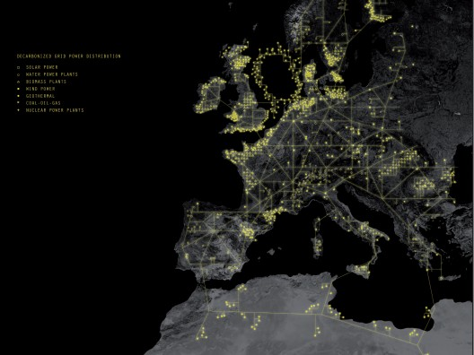
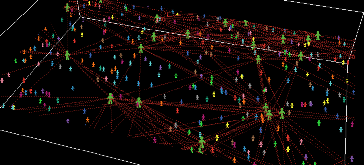
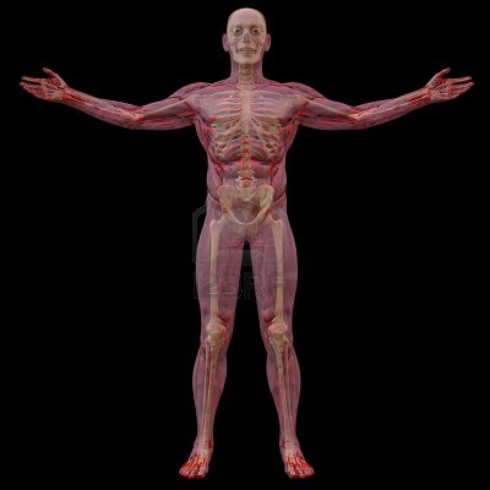
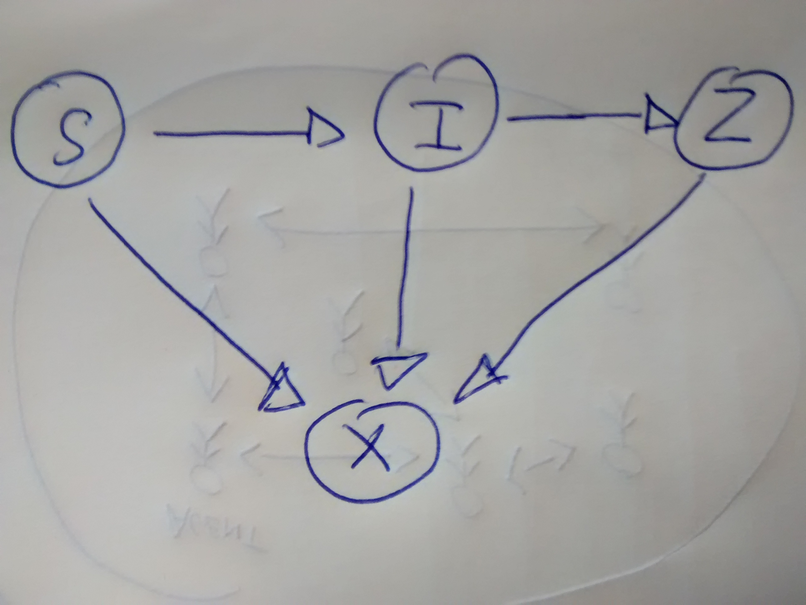
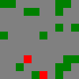
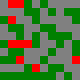

---

# Zombie, Braaaaaain, and Ruby

Christophe Philemotte, Paris.rb, 6 January 2015

---

### About me

* Developer ([@toch on GitHub](https://github.com/toch), [@_toch on Twitter](https://twitter.com/_toch))
* Author on [blog.8thcolor.com](http://blog.8thcolor.com)
* Founder of [PullReview.com](https://pullreview.com)

<br/>


---

## Intro

---

### What's agent based modeling?



---

### why it's important?

* Complex Phenomena
* Macro is not enough
* Grasp Network

---

### Which use case?

---



---

 

---



---


---



---

## We are humans, we are not alone


---

### Model of a human, and its demography



---

```Ruby
class Agent
  attr_reader :state, :state_age, :current_action
  attr_accessor :position

  def initialize(map, stm)
    # ...
  end

  def walk(direction)
    # ...
  end

  def perceive
    # ...
  end

  def act
    # ...
  end

  def age
    # ...
  end

  def commit
    # ...
  end
end
```

---

### Model of Environment and Interactions


---

```Ruby
class Map
  attr_reader :width, :height
  def initialize(width, height, point_klass = Point)
    # ...
  end

  def point(x, y)
    # ...
  end

  def free_random_position
    # ...
  end
end
```

---

## Be Healthy, Dead, or a Zombie

```Ruby
class State
  attr_reader :name
  def initialize(name, action_strategy = ->(agent){ :stay })
  end

  def add_transition(target, check, priority = 0)
    # ...
  end

  def trigger_transition(agent)
    # ...
  end

  def decide_action_for(agent)
    # ...
  end
end
```

---

### Model of a State transition machine



---

```Ruby
class StateTransitionMachine
  attr_reader :states
  def initialize(rand_klass = Random)
    @prng = rand_klass.new
    @states = {
      susceptible: State.new(
                     :susceptible,
                     ->(agent) {
                       [:walk, :stay, :fight].sample
                     }
                   ),
      infected: State.new(
                  :infected,
                  ->(agent) {
                    [:walk, :stay, :fight].sample
                  }
                ),
      zombie: State.new(
                :zombie,
                ->(agent) {
                  [:walk, :fight].sample
                }
              ),
      dead: State.new(:dead)
    }

    @states[:susceptible].add_transition(
      @states[:infected],
      ->(state, agent) {
        agent.position.neighborhood.each do |_, position|
          return true if
            position &&
            !position.empty? &&
            position.contents.state.name == :zombie &&
            position.contents.current_action == :fight &&
            @prng.rand(100) < 10
        end
        false
      }
    )

    @states[:infected].add_transition(
      @states[:zombie],
      ->(state, agent) {
        agent.state_age > 120
      }
    )

    @states[:susceptible].add_transition(
      @states[:dead],
      ->(state, agent) {
        agent.position.neighborhood.each do |_, position|
          return true if
            position &&
            !position.empty? &&
            position.contents.state.name == :zombie &&
            position.contents.current_action == :fight &&
            @prng.rand(100) < 10
        end
        false
      },
      10
    )


    @states[:infected].add_transition(
      @states[:dead],
      ->(state, agent) {
        agent.position.neighborhood.each do |_, position|
          return true if
            position &&
            !position.empty? &&
            position.contents.state.name == :zombie &&
            position.contents.current_action == :fight &&
            @prng.rand(100) < 10
        end
        false
      }
    )

    @states[:zombie].add_transition(
      @states[:dead],
      ->(state, agent) {
        agent.position.neighborhood.each do |_, position|
          return true if
            position &&
            !position.empty? &&
            [:susceptible, :infected].include?(position.contents.state.name) &&
            position.contents.current_action == :fight &&
            @prng.rand(100) < 10
        end
        false
      }
    )
  end

  def default_state
    return @states[:zombie] if @prng.rand(100) < 20
    @states[:susceptible]
  end
end
```

---

## Zombie swarm and Survival Strategies

---

```Ruby
class StateTransitionMachine
  attr_reader :states
  def initialize(rand_klass = Random)
    @prng = rand_klass.new
    @states = {
      susceptible: State.new(
                     :susceptible,
                     ->(agent) {
                       [:walk, :stay, :fight].sample
                     }
                   ),
      infected: State.new(
                  :infected,
                  ->(agent) {
                    [:walk, :stay, :fight].sample
                  }
                ),
      zombie: State.new(
                :zombie,
                ->(agent) {
                  [:walk, :fight].sample
                }
              ),
      dead: State.new(:dead)
    }

    @states[:susceptible].add_transition(
      @states[:infected],
      ->(state, agent) {
        agent.position.neighborhood.each do |_, position|
          return true if
            position &&
            !position.empty? &&
            position.contents.state.name == :zombie &&
            position.contents.current_action == :fight &&
            @prng.rand(100) < 10
        end
        false
      }
    )

    @states[:infected].add_transition(
      @states[:zombie],
      ->(state, agent) {
        agent.state_age > 120
      }
    )

    @states[:susceptible].add_transition(
      @states[:dead],
      ->(state, agent) {
        agent.position.neighborhood.each do |_, position|
          return true if
            position &&
            !position.empty? &&
            position.contents.state.name == :zombie &&
            position.contents.current_action == :fight &&
            @prng.rand(100) < 10
        end
        false
      },
      10
    )


    @states[:infected].add_transition(
      @states[:dead],
      ->(state, agent) {
        agent.position.neighborhood.each do |_, position|
          return true if
            position &&
            !position.empty? &&
            position.contents.state.name == :zombie &&
            position.contents.current_action == :fight &&
            @prng.rand(100) < 10
        end
        false
      }
    )

    @states[:zombie].add_transition(
      @states[:dead],
      ->(state, agent) {
        agent.position.neighborhood.each do |_, position|
          return true if
            position &&
            !position.empty? &&
            [:susceptible, :infected].include?(position.contents.state.name) &&
            position.contents.current_action == :fight &&
            @prng.rand(100) < 10
        end
        false
      }
    )
  end

  def default_state
    return @states[:zombie] if @prng.rand(100) < 20
    @states[:susceptible]
  end
end
```

---

### Calibration


---

### Simulation

---



---



---

## Outro

* Unit Test
* Each part is simple
* Interactions is complex
* Calibration is the key
